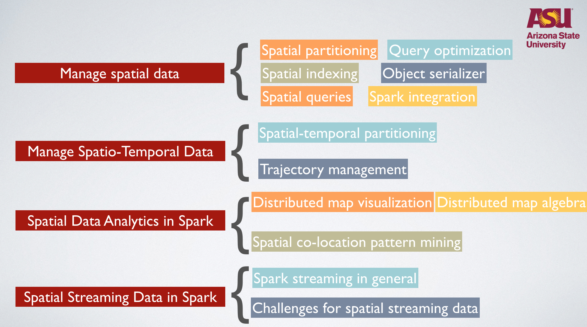
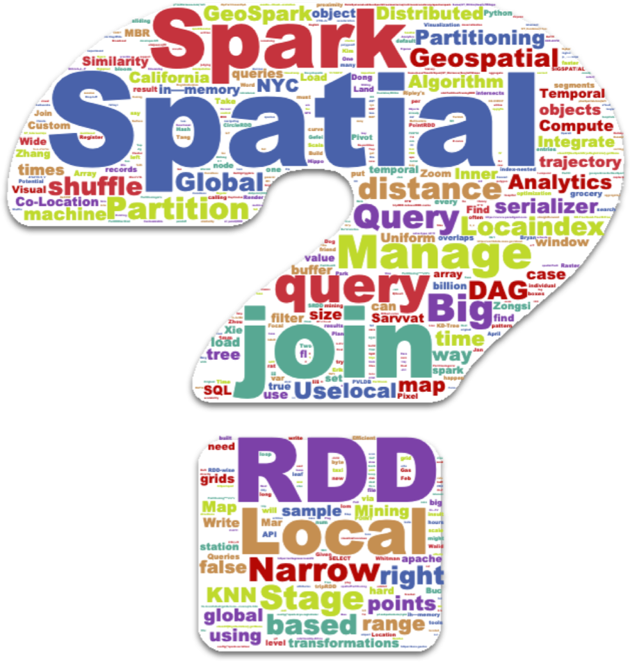

# Geospatial Data Management in Apache Spark

Welcome to our ICDE 2019 tutorial!

## Schedule

Time: 14:35 - 16:05, April 10th, 2019 (Wednesday, Conference Day 3) 

Localtion: Room 7101-7102, Parisian Macau 5th floor, Macau, China

## Outline

## Slides

You can download [presentation slides (PDF)](https://www.public.asu.edu/~jiayu2/presentation/jia-icde19-tutorial.pdf) and [tentative tutorial abstract (PDF)](https://www.public.asu.edu/~jiayu2/geospark/publication/geospatial-icde-2019.pdf) via the given link.

To watch the animated presentation slides, please open [animated presentation slides](https://www.public.asu.edu/~jiayu2/presentation/jia-icde19-tutorial/index.html) using Safari or Firefox.

## Tutorial video

[Tutorial video on YouTube](https://youtu.be/v2wZBk7oaKg)

[Original tutorial video](http://www.public.asu.edu/~jiayu2/video/tutorial-icde2019.mp4)

## Benchmark

Most of the components mentioend in the tutorial have been implemented in GeoSpark. Please feel free to use GeoSpark in your benchmark.

Please visit [GeoSpark website](http://datasystemslab.github.io/GeoSpark/) for more details.

## Contact

The tutorial was presented by Jia Yu and Mohamed Sarwat. If you have any questions, please contact us.

[Jia Yu](https://jiayuasu.github.io/) (jiayu2@asu.edu)

[Mohamed Sarwat](http://faculty.engineering.asu.edu/sarwat/) (msarwat@asu.edu)

Arizona State University

